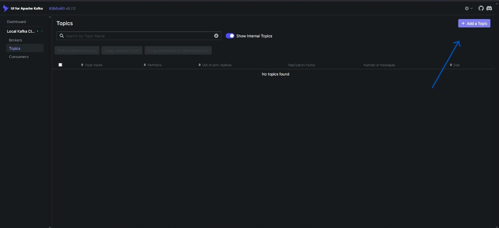
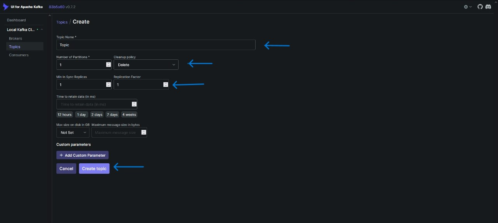
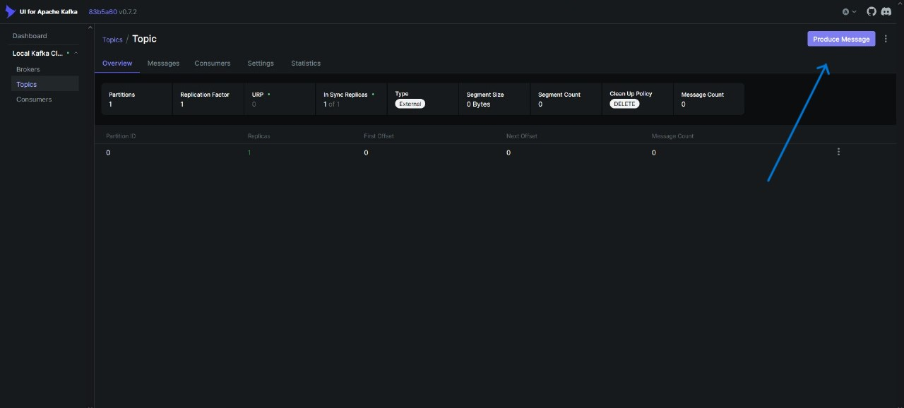
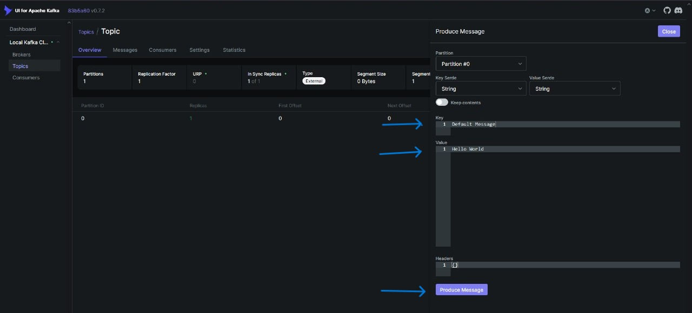
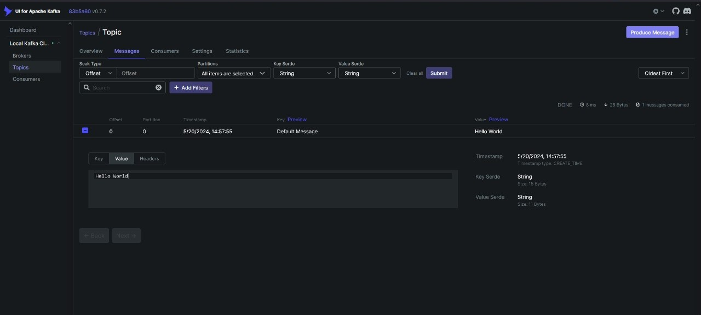

# Kafka-Python


**First You Can Create Poetry Project**
----------------------------------------------
 * Create Folder
 * Open Folder In CMD
 * Write This Command In Terminal

```bash
poetry new .
```

 * It create project in your folder

**Second Step You Can Add Packages**
------------------------------------
<h1>Like These Packages</h1>

 * Fastapi
 * SqlModel
 * uvicorn
 * AioKafka
 * Python-dotenv 

**Third Create Docker File Were your pyproject file**
-----------------------------------------------
<h1>If you don't know how to create then you can copy below code</h1>

 * How to create docker file
 * First you can create file with specify name which is Dockerfile,Dockerfile.dev etc
 * Second if you dont't know how to write docker file thennn copy below code

 ```bash
FROM python:3.12

RUN apt-get update && apt-get install -y \
    build-essential \
    libpq-dev \
    protobuf-compiler \
    && rm -rf /var/lib/apt/lists/*

    
WORKDIR /app

COPY . /app/

RUN pip install poetry 

RUN poetry config virtualenvs.create false


RUN poetry install --no-interaction --no-root

CMD [ "poetry","run","uvicorn","kafka.main:app","--host","0.0.0.0","--reload" ]
```


**Third Step Create compose file**
--------------------------------------------------------
 * If you don't know how to create .Don't Worry
 * First you can create file with specify name which is docker-compose.yml,docker-compose.yml,docker-compose.yaml etc
 * yml or yaml is same 
 * Second if you donn't know how to write compose file ,You can copy below code

 ```bash
 version: '3.12'

services:
   my-api:
     build:
       context: ./kafka_ui
       dockerfile: Dockerfile
     ports:
       - 8000:8000
```


 * Then you can create file your first folder,which is create on the behalf of your foldername
 * In Folder you can  create python file ,with the name of main.
 * In file you can create a simple hello world api with the use of Fastapi
 * If you don't Know how  to write Then copy below code
 ```python
 from fastapi import FastAPI

 app:FastAPI=FastAPI()

 @app.get("/")
 def index():
    return{"message":"Hello World"}
 ```
 * After This,Open Your Terminal
 * Write The Below Command in your terminal

 ```bash
 docker compose up
 ```
 * It takes time to make a image or container.
 * After This,Open Your Browser,
 * Write 127.0.0.1:8000 if Hello World Print on Browser
 * Then You Can Down Your Container ,With the Below Command
 ```bash
 docker compose down -d
 ```

**Fourth Step Upgrade Your Code**
--------------------------------
* Clean Your compose file
* Then, Copy Below Code OR Paste In Compose File


```bash
version: "3.8"

services:
  gamer:
    image: "myapi-img"
    container_name: "myapi-container"
    build:
      context: ./kafka_ui
      dockerfile: Dockerfile
    ports:
      - "8000:8000"
    volumes:
      - "./kafka_ui:/app"

  broker:
    image: apache/kafka:3.7.0
    hostname: broker
    container_name: broker
    ports:
      - "9092:9092"
    environment:
      KAFKA_NODE_ID: 1
      KAFKA_LISTENER_SECURITY_PROTOCOL_MAP: "CONTROLLER:PLAINTEXT,PLAINTEXT:PLAINTEXT,PLAINTEXT_HOST:PLAINTEXT"
      KAFKA_ADVERTISED_LISTENERS: "PLAINTEXT_HOST://localhost:9092,PLAINTEXT://broker:19092"
      KAFKA_PROCESS_ROLES: "broker,controller"
      KAFKA_CONTROLLER_QUORUM_VOTERS: "1@broker:29093"
      KAFKA_LISTENERS: "CONTROLLER://:29093,PLAINTEXT_HOST://:9092,PLAINTEXT://:19092"
      KAFKA_INTER_BROKER_LISTENER_NAME: "PLAINTEXT"
      KAFKA_CONTROLLER_LISTENER_NAMES: "CONTROLLER"
      CLUSTER_ID: "4L6g3nShT-eMCtK--X86sw"
      KAFKA_OFFSETS_TOPIC_REPLICATION_FACTOR: 1
      KAFKA_GROUP_INITIAL_REBALANCE_DELAY_MS: 0
      KAFKA_TRANSACTION_STATE_LOG_MIN_ISR: 1
      KAFKA_TRANSACTION_STATE_LOG_REPLICATION_FACTOR: 1
      KAFKA_LOG_DIRS: "/tmp/kraft-combined-logs"

  kafka-ui:
    image: provectuslabs/kafka-ui
    container_name: kafka-ui
    ports:
      - "8080:8080"
    environment:
      KAFKA_CLUSTERS_0_NAME: "Local Kafka Cluster"
      KAFKA_CLUSTERS_0_BOOTSTRAPSERVERS: "broker:19092"
      DYNAMIC_CONFIG_ENABLED: "true"
    depends_on:
      - broker

networks:
  default:
    driver: bridge

```

* Then Clean Your main.py code
* Copy Below Code And Paste in python file

* AIO Kafka Link ----> <a href="https://github.com/aio-libs/aiokafka">AioKafka Documention </a> 

```python
from fastapi import FastAPI
from aiokafka import AIOKafkaConsumer
from contextlib import asynccontextmanager
import asyncio


KAFKA_TOPIC = "Topic"
KAFKA_SERVER = "broker:19092"
KAFKA_GROUP_ID = "group_id"


async def consumer():
    consumer = AIOKafkaConsumer(
        KAFKA_TOPIC,
        bootstrap_servers=KAFKA_SERVER,
    )
    # Get cluster layout and join group `my-group`
    await consumer.start()
    try:
        # Consume messages
        async for msg in consumer:
            print(
                "consumed: ",
                msg.topic,
                msg.partition,
                msg.offset,
                msg.key,
                msg.value,
                msg.timestamp,
            )
    finally:
        # Will leave consumer group; perform autocommit if enabled.
        await consumer.stop()

@asynccontextmanager
def lifespan(app:FastAPI):
    print("Create Connsumer")
    asyncio.create_task(consumer())
    print("Created")
    yield


app: FastAPI = FastAPI(lifespan=lifespan)


@app.get("/")
def index():
    return {"message": "Hello World"}


```

* Then Open Your Terminal
* Write This command 

```bash
docker compose up -d --build
```

* Then Open Kafka Ui 
* Open Browser and Write localhost:8080
* Then Kafka UI Open,Then Click On Topic 
* Create Topic which you can create inn main.py file which name is "Topic"

**Step 1 : Create Topic**
 
 

**Step 2 : Produce Message**





 
* After the creation of Topic 
* Produce message 
* Click on Produce Message And Then Write Message
* Then Open Your Terminal After the Produce of Message
* Write The Below Command
```bash
docker ps
```
* Then See Apache Kafka Container id And Copy It 
* Then Write the command in terminal
```bash
docker logs container <id>
```
* Then You Can See Your Message in Terminal
* Then You Can Create Producer Api
```python
from fastapi import FastAPI
from aiokafka import AIOKafkaConsumer, AIOKafkaProducer
import asyncio
from contextlib import asynccontextmanager
from sqlmodel import SQLModel
import logging

logging.basicConfig(level=logging.INFO)

KAFKA_BROKER = "broker:19092"
KAFKA_TOPIC = "gamers"
KAFKA_CONSUMER_GROUP_ID = "gamers-consumer-group"

class GamePlayersRegistration(SQLModel):
    player_name: str
    age: int
    email: str
    phone_number: str


async def consume():
    # Milestone: CONSUMER INTIALIZE
    consumer = AIOKafkaConsumer(
        KAFKA_TOPIC,
        bootstrap_servers=KAFKA_BROKER
    )

    await consumer.start()
    try:
        async for msg in consumer:
            logging.info(
                "{}:{:d}:{:d}: key={} value={} timestamp_ms={}".format(
                    msg.topic, msg.partition, msg.offset, msg.key, msg.value,
                    msg.timestamp)
            )
    finally:
        await consumer.stop()


@asynccontextmanager
async def lifespan(app: FastAPI):
    print("Starting consumer")
    asyncio.create_task(consume())
    yield
    print("Stopping consumer")

app = FastAPI(lifespan=lifespan)


@app.get("/")
def hello():
    return {"Hello": "World"}


@app.post("/register-player")
async def register_new_player(player_data: GamePlayersRegistration):
    producer = AIOKafkaProducer(bootstrap_servers=KAFKA_BROKER)

    await producer.start()

    try:
        await producer.send_and_wait(KAFKA_TOPIC, player_data.model_dump_json().encode('utf-8'))
    finally:
        await producer.stop()

    return player_data.model_dump_json() 

```
* Now Open Browser
* Click This Link <a href="http://127.0.0.1:8000/docs">Click</a>
* Firstly Create Topic And Then Create message in Browser

**I Hope You Create This And Enjoy It.**

**If You want to contact me .Dm me on Linkedin**
----------------------------------------------
Linkedin: <a href="https://www.linkedin.com/in/saqib-imran-537759230/">Dm me</a>


 
